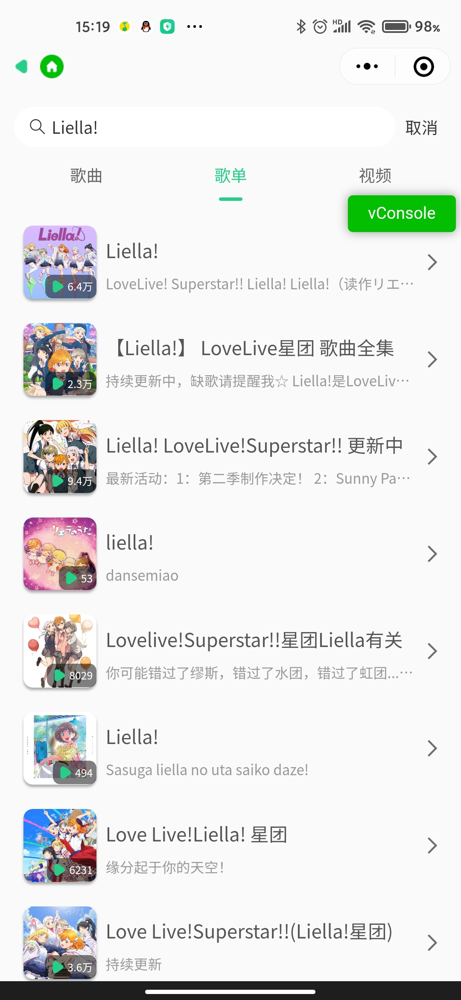

# 微信小程序云音乐项目

### 1. 项目介绍
LiliYao-NeteaseMusic-wechat 如果对各位朋友有用的话, 希望可以给个star⭐

#### 技术栈
- 使用微信小程序原生 WXML + WXSS + JS 进行开发
- 使用 wx.request() 进行网络请求
- CSS 使用 FLEX 进行布局
- 项目组件库使用 Vant Weapp

#### 项目使用库
- Vant Weapp
- pinyin-pro
- hy-event-store

#### 项目目标
- 使用微信小程序开发云音乐项目

### 2. 页面效果和功能展示

- 项目首页
1. 首页轮播图 / 推荐新歌

2. 个性推荐 / 巅峰榜

- MV 页面
1. 可切换地区和类型

- 登录页面

- 用户页面
1. 历史播放记录

2. 收藏歌单

- 巅峰榜详情

- 歌单详情

- 搜索界面
1. 推荐搜索 / 历史搜索记录

2. 歌曲 / 歌手 / 歌单 / 视频

3. 英文转拼音适配 / 文字高亮

- 播放页面
1. 暂停 / 切换上下首歌曲 / 切换播放模式

2. 歌词页面

3. 相关歌曲 / 评论

4. 歌曲列表

- 迷你播放栏
1. 歌词 / 播放列表 / 开始暂停 / 点击跳转到播放页面

### 3. 项目源码与 API 接口
- 项目 Github 地址：
- 项目 Gitee 地址：
- 视频演示地址：https://www.bilibili.com/video/BV1Wr4y1Y71D/
- API 接口：https://binaryify.github.io/NeteaseCloudMusicApi/#/

### 4. 项目说明

1.  这次项目算是我第一次动手完成的一个比较完整的项目，我自己知道的已经有很多不足，但还是成功在年前的最后一天完成，希望能够作为以后学习的基础。之前有思考过做一些电商项目练练手，但考虑了一下还是选择了做音乐项目，比较有趣。通过这个项目我也切实的收获很多。
2.  本项目主要完成了歌曲、歌单、榜单三个大部分的内容，其他例如电台之类的没有进行开发。
3.  本项目完全开源，仅供学习使用，将项目拉取下来，使用微信开发者工具应该就能够使用。如果对您的学习有所帮助，希望可以给个star⭐
4.  祝大家新年快乐！！！ - 2022.01.31

### 5. 致谢
- 非常感谢王红元老师的小程序音乐项目开发实战让我学习到很多小程序相关的知识
- 非常感谢后台提供者Binaryify，接口很稳定，文档很完善，收获很多
